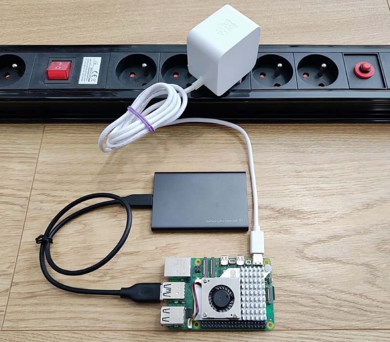

### Connection Diagram

Once you have all the hardware collected, you will need to unbox the Raspberry Pi device and connect it according to the specifications below:

### Photos

Below, you can see photos of an example setup:

### Next Step

[➡️ Click here to move to the next step & prepare Raspberry Pi images. ➡️](./3-raspberry-pi-images.md)
