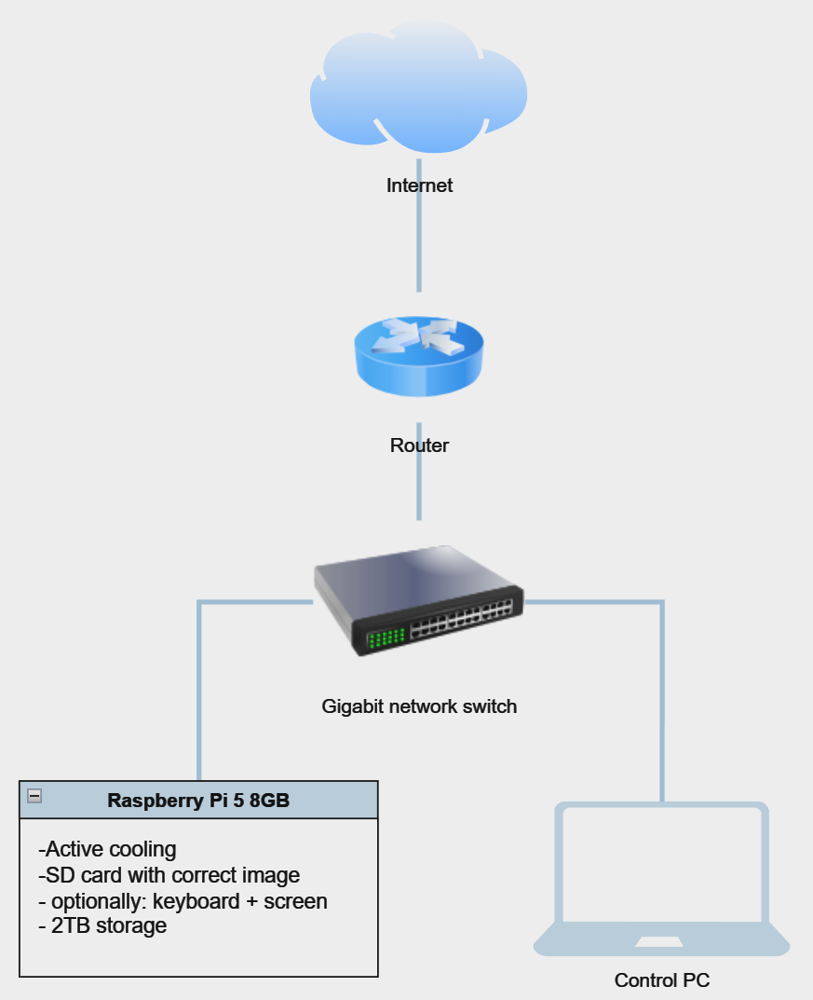

# Installation
The Raspberry Pi 5 devices will be configured during the initial run, and their software will be updated. 
After this step, devices can be used to host an **Ethereum Node**.


### Warning
⚠️ **In most cases, the installation script erases the SSD content.** ⚠️


### Checklist before the installation
- Make sure that the device is configured correctly (i.e., it has a valid active cooling system installed)
- Make sure that you use the correct SSD (2TB or more)
- Internet access is required

The contents will not be erased if you have already configured **Ethereum on Pi** using this SSD. If you want, however, to force the installer to erase the configured disk, connect it to any device that you can access and follow these commands:
```bash
cd /home/ethereum
touch .format_me
```
The installer will forcefully erase the SSD if the file _.format\_me_ exists in the `/home/ethereum` directory.

### Installation
- Insert the previously prepared SD card into the device
- Connect the SSD to the USB 3.0 port or use NVMe m.2 drive with PCIe adapter
- Connect the Ethernet cable to the device
- Optionally: connect HDMI cable to the monitor and the device using HDMI 0 port (on the device)
- Make sure that all accessories are connected as shown below
\
\

- Connect the Raspberry Pi 5 power supply to the device

After the device is powered up, it will enter the process of updating the software and configuring itself to act as an **Ethereum Node**.

Due to the cloud updates configured by default, the Ethereum installation tasks from the installation script (_rc.local_) may not be executed during the first run. Based on the initial setup, there are two procedures to follow.

#### With a HDMI monitor connected
Look at the displayed log messages. If the _rc.local_ configuration script was started, wait for it to finish. Otherwise
- Wait for the cloud update to finish
- Log into the device using the default user credentials[^1]
- Reboot the device with the command:
  ```bash
  sudo reboot
  ```

During the second run, the installation script should be executed correctly. Wait for the configuration to finish.

#### Without a monitor
Wait 15 minutes and try to log in as _ethereum/ethereum_ via SSH. If the user is unavailable, the first run did not execute the installation tasks. In such case
- Log into the device using the default user credentials[^2]
- Reboot the device with the command:
  ```bash
  sudo reboot
  ```

### Installation verification
The verification procedure is identical for both devices. To verify that the installation was successful, follow these steps:

#### Account verification
- SSH login into the device as _ethereum/ethereum_
  - If the _ethereum_ user does not exist, it means that the installation failed unexpectedly (in such case, _contact the support_)
- By default, _ethereum_ user is forced to change the password during the first login

#### Network configuration verification
- From Raspberry Pi device run the command:
  ```bash
  ping google.com
  ```

To configure key-based authentication to access devices, follow this [guideline](./4a-ssh-key-based-authentication.md).

### Summary
At this point, both devices are configured and ready to host and **Ethereum Node**. A detailed procedure for running two devices as a single node is described in the following sections.

# Next Step

[➡️ Click here to move to next step & learn about overclocking your devices ➡️](./5-overclocking.md)
