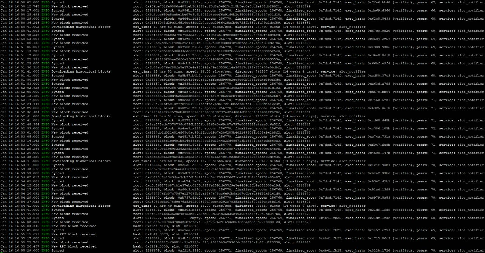

## Running Geth

### Starting a Lighthouse Node
The installation script has already created all the files required to run a node.

Launch the _lighthouse_ client in a screen session by executing these commands:
  ```bash
  cd ~/clients/screen
  ./screen-consensus-cli.sh
  ```


After the above steps and checks, the **lighthouse client** runs in a separate screen session named **lighthouse**.

### Subsequent runs

Launching _lighthouse_ on an already configured device requires following the last step from the previous list, namely

```bash
cd ~/clients/screen
./screen-consensus-cli.sh
```

### Checking status

Because _lighthouse_ is running as an application and not a service, it must be monitored through the associated screen session. Assuming that you are logged into the _lighthouse-1_ device, you can see the _lighthouse_ status using these commands/actions

- `screen -ls` to make sure that the **lighthouse** session is active
- `screen -r lighthouse` to attach to the **lighthouse** session
- To detach from the session, press `Ctrl-a + d`.

## Reference

To ensure the client is synchronized, compare the output with the provided reference logs.

#### Lighthouse in an entry state

⚠️ **TODO** ⚠️

#### Lighthouse - checkpoint syncing:

Synced, but backfilling blocks.

The node is operational, but there are still some historical blocks to download. For additional information, consult the [Lighthouse Book](https://lighthouse-book.sigmaprime.io/checkpoint-sync.html#checkpoint-sync).



#### Lighthouse in a synced state:


## Next Step

[➡️ Click here to move to next step & learn about rebooting your nodes. ➡️](./3a-rebooting-device.md)
