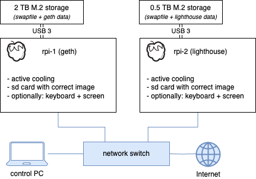

# Installation
The Raspberry Pi 4 devices will be configured during the initial run, and their software will be updated. After this step, devices can be used to host an **Ethereum Node**.

Due to the hardware limitations, a single **Ethereum Node** requires setting up and connecting two Raspberry Pi 4 devices (one to host a consensus client and another to host the corresponding execution client). The initial setup is the same for both devices.

## Step-by-step instruction
Follow the instructions below to finish the installation process successfully. Both devices have to be configured this way. Steps to be followed for each device:

### Warning
⚠️ **In most cases, the installation script erases the SSD content.** ⚠️

The contents will not be erased if you have already configured **Ethereum on Pi** using this SSD. If you want, however, to force the installer to erase the configured disk, connect it to any device that you can access and follow these commands:
```bash
cd /home/ethereum
touch .format_me
```
The installer will forcefully erase the SSD if the file _.format\_me_ exists in the `/home/ethereum` directory.

### Checklist before the installation
- Make sure that the device is configured correctly (i.e., it has a valid active cooling system installed)
- Make sure that you use the correct SSD (Geth device: 2TB, Lighthouse device: 0.5TB)

### Installation
- Insert the previously prepared SD card into the device
- Connect the SSD to the USB 3.0 port
- Connect the Ethernet cable to the device
- Optionally: connect HDMI cable to the monitor and the device using HDMI 0 port (on the device)
- Make sure that all accessories are connected as shown below
\
\

- Connect the default Raspberry Pi 4 power supply to the device

After the device is powered up, it will enter the process of updating the software and configuring itself to act as an **Ethereum Node**.

Due to the cloud updates configured by default, the Ethereum installation tasks from the installation script (_rc.local_) may not be executed during the first run. Based on the initial setup, there are two procedures to follow.

#### With a HDMI monitor connected
Look at the displayed log messages. If the _rc.local_ configuration script was started, wait for it to finish. Otherwise
- Wait for the cloud update to finish
- Log into the device using the default user credentials[^1]
- Reboot the device with the command:
  ```bash
  sudo reboot
  ```
[^1]: See the [geth device configuration](./3-raspberry-pi-images.md#1-geth)

During the second run, the installation script should be executed correctly. Wait for the configuration to finish.

#### Without a monitor
Wait 15 minutes and try to log in as _ethereum/ethereum_ via SSH. If the user is unavailable, the first run did not execute the installation tasks. In such case
- Log into the device using the default user credentials[^2]
- Reboot the device with the command:
  ```bash
  sudo reboot
  ```
[^2]: See the [lighthouse device configuration](./3-raspberry-pi-images.md#1-lighthouse)

### Installation verification
The verification procedure is identical for both devices. To verify that the installation was successful, follow these steps:

#### Account verification
- SSH login into the device as _ethereum/ethereum_
  - If the _ethereum_ user does not exist, it means that the installation failed unexpectedly (in such case, _contact the support_)
- By default, _ethereum_ user is forced to change the password during the first login

#### Network configuration verification
- SSH login into the _geth-1_ device and run a command:
  ```bash
  ping lighthouse-1.local
  ```
- SSH login into the _lighthouse-1_ device and run a command:
  ```bash
  ping geth-1.local
  ```
  > _If the network configuration is valid, both devices should be able to reach each other_
- From _geth-1_ device and _lighthouse-1_ device run a command:
  ```bash
  ping google.com
  ```
  > _If the network configuration is valid (access to the Internet), both devices should be able to reach the remote host_

To configure key-based authentication to access devices, follow this [guideline](./4a-ssh-key-based-authentication.md).

### Summary
At this point, both devices are configured and ready to host and **Ethereum Node**. A detailed procedure for running two devices as a single node is described in the following sections.

# Next Step

[➡️ Click here to move to next step & learn about overclocking your devices ➡️](./5-overclocking.md)
