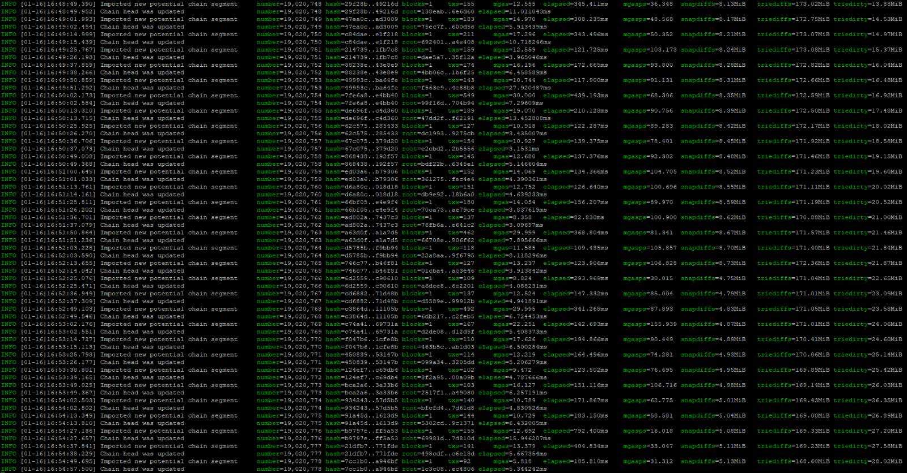

## Running Geth

### Starting a Geth Node
The installation script has already created all the files required to run a node.

- Launch the _geth_ client in a screen session by executing these commands:
  ```bash
  cd ~/clients/screen
  ./screen-exec-cli.sh
  ```
  After the above steps, the **go-ethereum client** runs in a separate screen session named **geth**.

### Subsequent runs
Launching _geth_ on an already configured device requires following the last step from the previous list, namely:
```bash
cd ~/clients/screen
./screen-exec-cli.sh
```

### Checking status
Because _geth_ is running as an application and not a service, it must be monitored through the associated screen session. You can see the _geth_ status using these commands/actions:
- `screen -ls` to make sure that the **geth** session is active
- `screen -r geth` to attach to the **geth** session
- To detach from the session, press `Ctrl-a + d`.

## Reference
To ensure the client is synchronized, compare the output with the provided reference logs.

#### Geth in a synced state:



## Next Step

[➡️ Click here to move to next step & see how to start lighthouse node. ➡️](./2-lighthouse-node.md)
