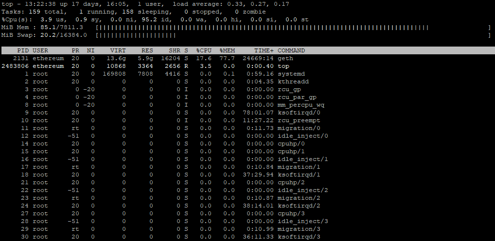

## Basic monitoring
Installation script configures three screen sessions for basic monitoring, namely _temp_, _freq_, and _iotop_. All sessions are automatically created during subsequent reboots.

### Monitoring Details
List of monitoring sessions:
- _**temp**_ runs a command `watch -n 5 vcgencmd measure_temp` which measures the CPU temperature at five-second intervals
- _**freq**_ runs a command `watch -n 5 vcgencmd measure_clock arm`, which measures the CPU frequency at five-second intervals
- _**iotop**_ runs a command `sudo iotop -ao -d 5` to monitor disk use (updated every five seconds)

### Handy screen commands
- `screen -r <session_name>` to attach to an existing session
  - to attach to the **iotop** session, type `screen -r iotop`
- `screen -r -d <session_name>` to reattach to an existing, active session
  - to reattach to the **temp** session, type `screen -r -d temp`
- To detach from the session, press `Ctrl-a + d`

### Top to the rescue
The `top` command can monitor the CPU and memory use.

Memory use is crucial when running the **Ethereum node**, so it is convenient to configure the `top` always to show the memory use statistics. This requires two steps during an active `top` session:
- Press the `m` key to toggle the memory usage display
- To store the top configuration, press `Shift-w` (it will be automatically loaded during the next execution of the `top` command)

The `top` command also shows the device's uptime, which is pretty handy.

### Screenshots

#### `top`

#### `top` with memory usage displayed

---

## Next Step

[➡️ Click here to move to next step & learn how to setup RPC on your node ➡️](./3d-rpc.md)
